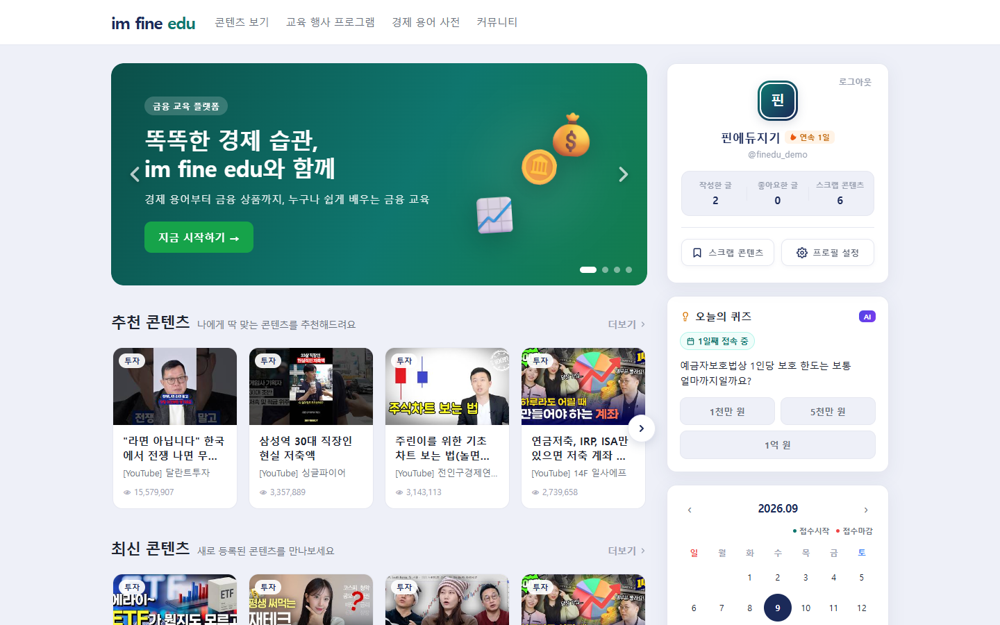
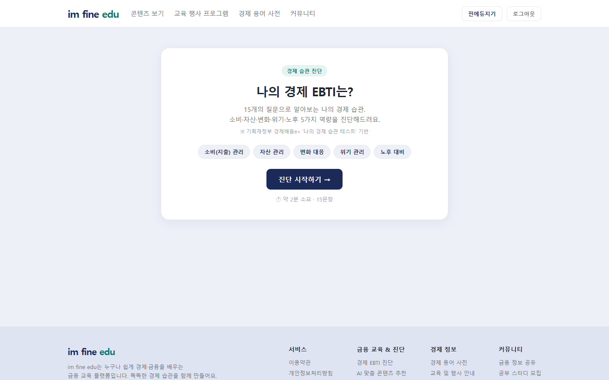
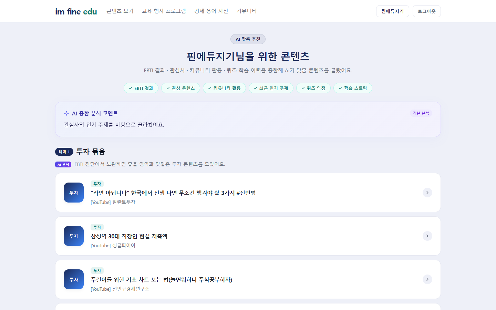
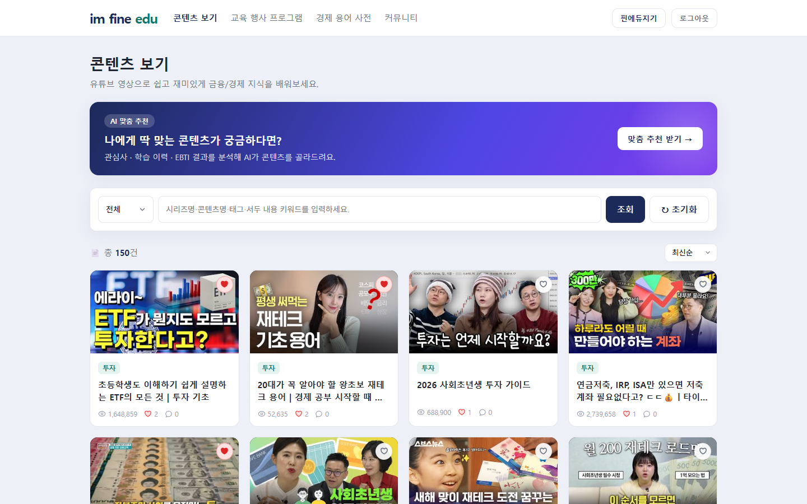
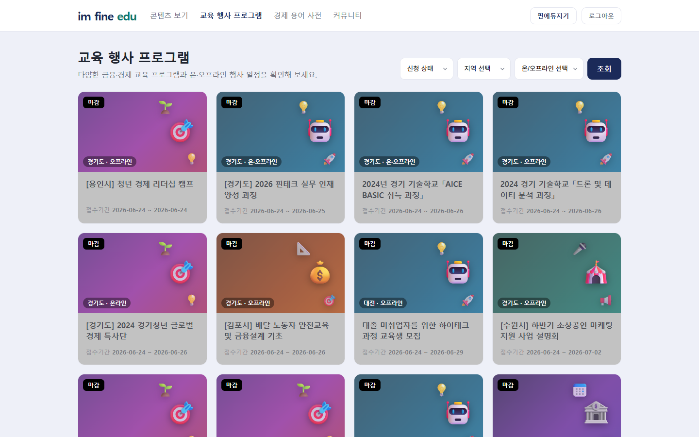
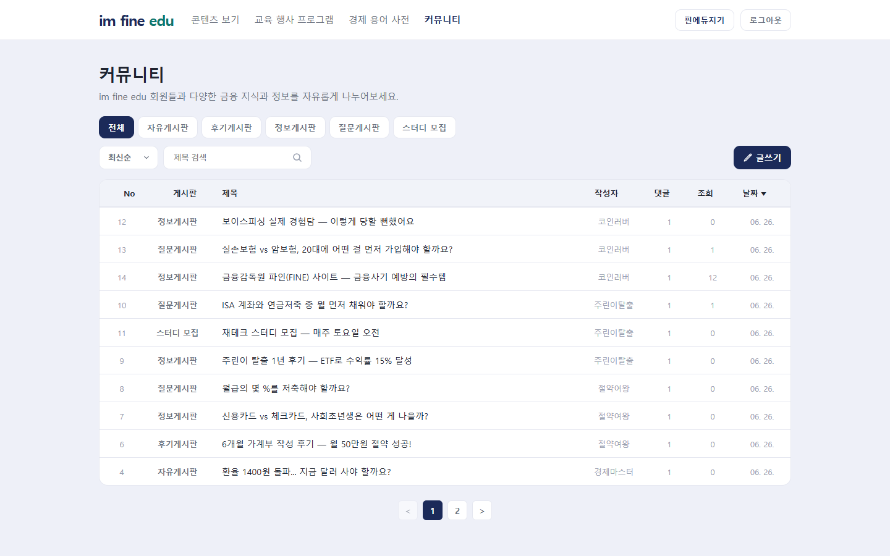

# 💰 FinEdu (im fine edu)

> ### "당신의 첫 금융 공부, 우리와 함께"
>
> 사회초년생과 청년을 위한 AI 맞춤형 금융 교육 플랫폼 — EBTI 금융 성향 테스트와 2단계 RAG 추천으로, 흩어진 금융 콘텐츠를 나에게 맞는 학습 경로로 엮어 줍니다.

- **서비스명**: FinEdu (im fine edu)
- **프로젝트 기간**: 2026.06.22 ~ 2026.06.26 (SSAFY 15기 1학기 관통 프로젝트)
- **개발 인원**: 2인 팀

---

## 목차

1. [프로젝트 개요](#1-프로젝트-개요)
2. [팀 구성](#2-팀-구성)
3. [기술 스택](#3-기술-스택)
4. [서비스 아키텍처](#4-서비스-아키텍처)
5. [주요 기능](#5-주요-기능)
6. [AI 기능 상세](#6-ai-기능-상세)
7. [사용자 인증 방식](#7-사용자-인증-방식)
8. [데이터 수집 방법](#8-데이터-수집-방법)
9. [API 명세](#9-api-명세)
10. [데이터베이스 설계](#10-데이터베이스-설계)
11. [프로젝트 구조](#11-프로젝트-구조)
12. [설치 및 실행](#12-설치-및-실행)
13. [환경 변수](#13-환경-변수)

---

## 1. 프로젝트 개요

### 기획 배경

금융 교육의 필요성은 날로 높아지지만, 대부분의 금융 정보는 전문가 용어로 가득하거나 개인의 상황과 무관한 일반론에 그칩니다. 특히 사회초년생은 첫 월급 관리부터 노후 준비까지 방대한 금융 지식을 단기간에 습득해야 하는 상황에 놓입니다.

**im fine edu**는 이러한 문제를 해결하기 위해 기획된 AI 기반 금융 교육 플랫폼입니다.

### 서비스 목표

- 사용자의 **금융 성향(EBTI 테스트)**을 분석하여 맞춤형 콘텐츠 추천
- YouTube 영상·정부 교육 과정 등 **다양한 채널의 콘텐츠를 한 곳에서** 제공
- **AI 2단계 RAG 파이프라인**으로 단순 추천을 넘어 스토리텔링이 있는 학습 경로 제시
- 커뮤니티·퀴즈·경제 용어 사전 등으로 **지속적인 학습 참여** 유도

---

## 2. 팀 구성

2인 팀(팀장: 백엔드·데이터 수집 파이프라인 중심) 중 **프론트엔드 전반과 AI 추천 연동**을 담당했습니다.

<table>
  <tr>
    <td align="center">
      
      
    </td>
  </tr>
  <tr>
    <td align="center">
      <br/>
      <a href="https://github.com/jangms11263124">장민석</a>
    </td>
  </tr>
</table>

- **Vue 3 SPA 화면 전반** — 홈, 콘텐츠 목록·상세, 마이페이지, 네비게이션 바·사이드 위젯, 전역 스타일
- **AI 추천 서비스 페이지** — 추천 번들 UX와 Pinia 기반 추천 캐시
- JWT 로그인 연동(Axios 인터셉터), EBTI 결과 localStorage 동기화 등 인증 플로우 프론트 구현
- 백엔드 contents 도메인 일부 보완


## 3. 기술 스택

<div>
  
  
  
  
</div>
<div>
  
  
  
  
</div>
<div>
  
  
  
  
</div>

### Backend

| 구분 | 기술 | 버전 | 용도 |
|------|------|------|------|
| 웹 프레임워크 | Django | 5.2.15 | API 서버, ORM, 관리자 |
| REST API | Django REST Framework | 3.17.1 | RESTful API 구성 |
| 인증 | djangorestframework-simplejwt | 5.5.1 | JWT 토큰 발급·검증 |
| CORS | django-cors-headers | 4.9.0 | 프론트엔드 허용 |
| 이미지 처리 | Pillow | 12.2.0 | 썸네일·프로필 이미지 |
| HTTP 클라이언트 | httpx | 0.28.1 | AI API 비동기 호출 |
| 환경변수 | python-dotenv | 1.0.1 | `.env` 파싱 |
| DB | SQLite | — | 개발 환경 데이터베이스 |

### Frontend

| 구분 | 기술 | 버전 | 용도 |
|------|------|------|------|
| UI 프레임워크 | Vue 3 | 3.5.34 | SPA 구성 (Composition API) |
| 빌드 도구 | Vite | 8.0.12 | 개발 서버·번들링 |
| 라우터 | Vue Router | 4.6.4 | 클라이언트 사이드 라우팅 |
| 상태관리 | Pinia | 3.0.4 | 전역 상태 (인증·추천 캐시) |
| HTTP 클라이언트 | Axios | 1.18.1 | API 통신, JWT 인터셉터 |
| 지도 | Kakao Maps API | — | 오프라인 행사 위치 표시 |

### 사용한 AI / 외부 API

| 서비스 | 용도 |
|--------|------|
| **Gemini 2.5 Flash** (SSAFY GMS Gateway) | RAG 1단계 — 콘텐츠 검색·선별 |
| **GPT-4o** (SSAFY GMS Gateway) | RAG 2단계 — 번들 생성·개인화 문구 |
| **YouTube Data API v3** | 금융 교육 영상 수집 |
| **Kakao Maps API** | 행사 지도 표시 |

---

## 4. 서비스 아키텍처

```
┌─────────────────────────────────────────────────────────────────┐
│                         사용자 브라우저                           │
│                    Vue 3 SPA (Vite, port 5173)                  │
│   Pinia Store (auth / recommend)  ←→  Axios (JWT 인터셉터)       │
└──────────────────────────┬──────────────────────────────────────┘
                           │ HTTP / REST API
┌──────────────────────────▼──────────────────────────────────────┐
│                  Django REST Framework (port 8000)               │
│  accounts │ contents │ community │ glossary │ quiz               │
│                    JWT 인증 미들웨어                              │
└──────────┬─────────────────────────────┬───────────────────────┘
           │                             │
  ┌────────▼────────┐         ┌──────────▼──────────────┐
  │  SQLite DB      │         │  SSAFY GMS AI Gateway    │
  │  (ORM)         │         │  ┌─────────────────────┐ │
  └─────────────────┘         │  │  Gemini 2.5 Flash   │ │
                              │  │  (Stage 1: Retrieve) │ │
  ┌─────────────────┐         │  ├─────────────────────┤ │
  │ YouTube Data    │         │  │  GPT-4o             │ │
  │ API v3         │         │  │  (Stage 2: Generate) │ │
  └────────┬────────┘         │  └─────────────────────┘ │
           │ 데이터 수집       └──────────────────────────┘
  ┌────────▼────────┐
  │ econedu.go.kr  │
  │ (크롤링)        │
  └─────────────────┘
```

---

## 5. 주요 기능



### 5.1 EBTI 금융 성향 테스트



**15문항** (5개 테마 × 3문항)으로 사용자의 금융 성향을 분석합니다.

| 테마 | 측정 내용 |
|------|----------|
| 소비지출관리 | 지출 습관, 예산 관리 능력 |
| 자산형성관리 | 저축·투자 성향, 자산 증식 관심도 |
| 경제변화대응 | 시장 변화 민감도, 정보 습득 패턴 |
| 위기·리스크관리 | 위험 대비, 보험·비상금 준비 |
| 노후준비 | 장기 재무 계획, 연금 인식 |

- 각 문항은 **5점 리커트 척도**로 응답
- 60% 이상(18점/30점) → **강점 테마** / 미만 → **약점 테마** 분류
- 결과는 `localStorage`에 저장, 로그인 후 백엔드와 동기화
- AI 추천의 핵심 입력 신호로 활용

### 5.2 AI 맞춤형 콘텐츠 추천



→ [AI 기능 상세 섹션](#6-ai-기능-상세) 참고

### 5.3 콘텐츠 라이브러리



| 항목 | 내용 |
|------|------|
| **카테고리** | 경제(economy), 투자(invest), 저축(saving), 금융(finance), 사회(society), 기타(etc) |
| **콘텐츠 유형** | YouTube 영상, 정부 교육과정, 외부 링크 |
| **검색** | 키워드 전문 검색 + EBTI 태그 → 동의어 확장 |
| **정렬** | 조회수 순, 오래된 순 |
| **개인화** | 좋아요·스크랩 기록 유지 |
| **댓글** | 로그인 사용자 댓글 작성 |

### 5.4 금융 교육 행사



정부 및 민간 기관의 금융 교육 프로그램을 모아 보여줍니다.

- **필터**: 신청 상태(모집 중/종료/마감), 지역, 진행 방식(오프라인/온라인/혼합)
- **D-Day** 카운트다운 표시
- **Kakao Maps** 오프라인 행사 위치 지도 표시
- 스크랩(북마크) 기능

### 5.5 오늘의 퀴즈

- **AI 생성 일일 퀴즈** (Gemini Flash, GPT-4o 중 하나)
- 하루 1회 응시 제한, 결과 및 해설 제공
- 틀린 퀴즈 주제 → AI 추천 신호로 활용
- 출석 체크 연동 (연속 출석일 계산)

### 5.6 경제 용어 사전

- **초성 인덱스** 검색 (한글 초성 자동 추출 로직)
- 분야별 필터 (경제, 경영, 금융, 사회과학 등)
- 키워드 전문 검색

### 5.7 커뮤니티



| 게시판 | 용도 |
|--------|------|
| 공지 | 서비스 공지사항 |
| 자유 | 일반 토론 |
| 후기 | 콘텐츠·행사 수강 후기 |
| 정보 | 금융 정보 공유 |
| Q&A | 질문·답변 |
| 스터디 | 스터디 모집 |

- 게시글 좋아요, 댓글·대댓글(중첩 구조)
- 인기 콘텐츠·활동 유저 리더보드

---

## 6. AI 기능 상세

### 6.1 개요

im fine edu의 AI 추천 엔진은 **2단계 RAG(Retrieval-Augmented Generation) 파이프라인**으로 구성됩니다. 단순 협업 필터링이나 키워드 매칭을 넘어, 사용자의 다차원 행동 데이터를 종합해 **스토리텔링이 있는 학습 경로**를 제시합니다.

AI API는 모두 **SSAFY GMS(Gateway Management Service)**를 통해 호출하며, Bearer 토큰 방식으로 인증합니다.

---

### 6.2 사용자 신호(Signal) 수집

추천 요청 시 다음 7가지 신호를 수집해 AI 프롬프트에 포함합니다.

| 신호 | 수집 방법 | AI 활용 방식 |
|------|----------|-------------|
| **EBTI 결과** | 프론트 `localStorage` → API 전달 | 강점/약점 테마로 콘텐츠 가중 |
| **좋아요한 카테고리** | `Content.likes` M2M 집계 | 관심 분야 파악 |
| **최근 본 콘텐츠 제목** | 좋아요 최신 5개 | 구체적 관심사 파악 |
| **커뮤니티 활동** | 작성 게시글·댓글 최신 5건 | 관심 주제 텍스트 분석 |
| **퀴즈 오답 주제** | `QuizAttempt.is_correct=False` 최신 5개 | 약점 보완 콘텐츠 추천 |
| **트렌딩 토픽** | 사이트 전체 좋아요 Top 3 카테고리 | 시의성 반영 |
| **연속 출석일** | `Attendance` 집계 | 학습 의지 레벨 조정 |

---

### 6.3 Stage 1: Gemini 2.5 Flash — 검색 및 선별

```
입력: 상위 60개 콘텐츠(corpus) + 7가지 사용자 신호
출력: 추천 Top 10 콘텐츠 + 각 1줄 요약
```

**역할**: 방대한 콘텐츠 풀에서 사용자 프로필에 가장 적합한 후보군을 빠르게 선별합니다.

- 모델: `gemini-2.5-flash-lite` (속도 최적화)
- 엔드포인트: `https://gms.ssafy.io/gmsapi/generativelanguage.googleapis.com/v1beta/models/{model}:generateContent`
- 프롬프트 전략: 사용자 신호를 구조화된 JSON으로 전달, 콘텐츠 본문 전체를 corpus로 제공

---

### 6.4 Stage 2: GPT-4o — 번들 생성 및 개인화

```
입력: Gemini가 선별한 Top 10 콘텐츠 + 사용자 상세 프로필
출력: 2개의 테마 번들 (각 3~4개 콘텐츠 + 스토리라인)
```

**역할**: 단순 목록이 아닌, 연결된 학습 경험을 설계합니다.

- 모델: `gpt-4o`
- 엔드포인트: `https://gms.ssafy.io/gmsapi/api.openai.com/v1/chat/completions`
- **Structured Outputs** 사용 → JSON 스키마 강제

**출력 구조 (JSON Schema)**:

```json
{
  "summary": "사용자에 대한 AI 코멘트 (실제 데이터 기반, 1~2문장)",
  "bundles": [
    {
      "title": "번들 테마 제목",
      "storyline": "이 번들을 추천하는 이유 (사용자 데이터 언급)",
      "content_ids": [1, 2, 3]
    },
    { ... }
  ]
}
```

- 프롬프트에서 "일반론 금지" 명시 → 반드시 실제 사용자 데이터(EBTI 태그, 오답 주제 등) 언급
- 번들 간 콘텐츠 중복 제거 로직

---

### 6.5 규칙 기반 폴백(Fallback)

AI API 장애 또는 GMS 키 미설정 시 자동으로 폴백합니다.

```
점수 = 좋아요 수 × 2 + 조회수 / 100 + EBTI 약점 태그 매칭 × 30
```

- 상위 콘텐츠를 카테고리별로 그룹화해 2개 번들 구성
- 출력 구조는 AI와 동일 → 프론트엔드 코드 변경 없음
- `source` 필드로 "ai" / "rule" 구분해 UI에 표시

---

### 6.6 일일 퀴즈 AI 생성

매일 Gemini Flash를 사용해 금융 관련 4지선다 퀴즈를 자동 생성합니다.

```python
# quiz/management/commands/generate_daily_quiz.py (또는 scheduled task)
# 생성 정보: 문제, 보기 4개, 정답 인덱스, 해설, 출처(ai/fallback)
```

- 생성 실패 시 미리 준비된 폴백 문제 제공
- `DailyQuiz.date`를 unique 키로 하루 1개 보장

---

### 6.7 YouTube 영상 AI 요약

데이터 수집 시 각 YouTube 영상 설명문을 Gemini Flash로 요약합니다.

```
프롬프트: "사회초년생·청년 직장인을 위해 이 영상을 3~4문장으로 요약해줘"
```

- 영상 제목 + 채널명 + 설명문을 입력으로 제공
- 요약 실패 시 원본 설명문 저장 (graceful fallback)

---

## 7. 사용자 인증 방식

### 7.1 인증 방식: JWT (JSON Web Token)

**사용 라이브러리**: `djangorestframework-simplejwt 5.5.1`

| 토큰 | 유효 기간 | 용도 |
|------|----------|------|
| Access Token | 2시간 | API 요청 인증 |
| Refresh Token | 14일 | Access Token 재발급 |

### 7.2 회원가입 플로우

```
1. POST /api/accounts/register/
   Body: { username, email, nickname, password, password_confirm }

2. RegisterSerializer 유효성 검사
   - 비밀번호 일치 확인
   - 이메일·유저네임 중복 확인

3. User 생성 (AbstractUser 상속, 커스텀 필드 추가)

4. 회원가입 성공 → 프론트에서 자동 로그인 호출
```

### 7.3 로그인 플로우

```
1. POST /api/accounts/login/ (Simple JWT TokenObtainPairView)
   Body: { username, password }

2. 서버: 자격증명 검증 → access + refresh 토큰 발급

3. 프론트: access 토큰을 localStorage에 저장
   (Pinia auth store: state.access)

4. 이후 모든 요청에 Axios 인터셉터가 헤더 자동 삽입
   Authorization: Bearer {access_token}
```

### 7.4 Axios JWT 인터셉터

```javascript
// src/api/index.js
api.interceptors.request.use(config => {
  const token = localStorage.getItem('access')
  if (token) config.headers.Authorization = `Bearer ${token}`
  return config
})

// 401 응답 → 토큰 무효화
api.interceptors.response.use(null, error => {
  if (error.response?.status === 401) {
    localStorage.removeItem('access')
    // → 재로그인 유도
  }
})
```

### 7.5 사용자 모델 (Custom User)

`AbstractUser`를 상속해 금융 교육 서비스에 맞는 필드를 추가했습니다.

| 필드 | 타입 | 설명 |
|------|------|------|
| `username` | CharField | 로그인 ID |
| `email` | EmailField | 이메일 |
| `nickname` | CharField | 표시 이름 |
| `profile_image` | ImageField | 프로필 사진 |
| `region` | CharField | 거주 지역 |
| `ebti_result` | JSONField | EBTI 테스트 결과 |

### 7.6 EBTI 동기화

EBTI 테스트는 로그인 없이 응시 가능하며, 결과를 `localStorage`에 임시 저장합니다. 이후 로그인 시 서버와 자동 동기화됩니다.

```javascript
// stores/auth.js - fetchMe()
async fetchMe() {
  const res = await api.get('/accounts/me/')
  this.user = res.data
  // localStorage에 EBTI 결과가 있고 서버에 없으면 → 동기화
  const localEbti = localStorage.getItem('ebtiResult')
  if (localEbti && !this.user.ebti_result) {
    await this.updateProfile({ ebti_result: JSON.parse(localEbti) })
  }
}
```

### 7.7 권한 정책

| 엔드포인트 유형 | 권한 |
|----------------|------|
| 콘텐츠·행사 목록·상세 조회 | 비로그인 허용 (IsAuthenticatedOrReadOnly) |
| 좋아요·스크랩·댓글·AI 추천 | 로그인 필수 |
| 회원정보 조회·수정 | 로그인 필수 (본인만) |
| 게시글 작성·수정·삭제 | 로그인 필수 (수정·삭제는 작성자만) |

---

## 8. 데이터 수집 방법

im fine edu의 콘텐츠는 두 가지 소스에서 자동 수집됩니다. 모두 Django Management Command로 구현했습니다.

---

### 8.1 YouTube Data API v3 — 영상 수집

**실행 명령**:
```bash
python manage.py fetch_youtube_contents [--count 150] [--clear] [--no-summarize]
```

#### 수집 전략

총 **56개 검색 쿼리**를 EBTI 5개 테마에 맞춰 구성했습니다.

| EBTI 테마 | 검색 쿼리 예시 | 쿼리 수 |
|-----------|--------------|---------|
| 기본 금융 교육 | "사회초년생 재테크", "청년 금융 교육" | 10개 |
| 소비지출관리 | "가계부 작성법", "소비 습관 개선" | 9개 |
| 자산형성관리 | "주식 투자 입문", "ISA 계좌 활용법" | 11개 |
| 경제변화대응 | "금리 인상 대처법", "환율 영향" | 9개 |
| 위기·리스크관리 | "비상금 만들기", "실비보험 가이드" | 8개 |
| 노후준비 | "퇴직연금 IRP", "국민연금 수령" | 9개 |

#### 수집 파이프라인

```
1. YouTube Search API 호출
   - 언어: 한국어 (relevanceLanguage=ko)
   - 카테고리: 교육(categoryId=27)
   - Safe Search: moderate
   - 최대 결과: 50개/쿼리

2. YouTube Videos API로 상세 정보 조회
   - snippet (제목, 채널명, 설명, 썸네일)
   - statistics (조회수)

3. Gemini Flash AI 요약 (--no-summarize 없을 시)
   - 영상 설명문 → 3~4문장 요약
   - 실패 시 원본 설명문 저장

4. 카테고리 자동 분류
   - 150+ 키워드 매핑 테이블
   - 제목 + 설명에서 키워드 매칭 → 5개 내부 카테고리
   - 매칭 실패 시 'etc' 카테고리

5. DB 저장
   - Content 모델에 youtube_id 포함 저장
   - 중복 방지: 처리된 ID 세트 관리
   - Rate Limiting: 0.3초 딜레이
```

#### YouTube API 설정

```python
YOUTUBE_SEARCH_URL = "https://www.googleapis.com/youtube/v3/search"
YOUTUBE_VIDEO_URL = "https://www.googleapis.com/youtube/v3/videos"
# API Key는 .env에서 로드
API_KEY = os.getenv("YOUTUBE_API_KEY")
```

---

### 8.2 경제배움e+ 크롤링 — 정부 교육과정 수집

**실행 명령**:
```bash
python manage.py crawl_econedu [--count 150] [--types ALL ON MX] [--no-detail] [--clear]
```

**대상 사이트**: [경제배움e+](https://econedu.go.kr) — 기획재정부 산하 정부 금융 교육 플랫폼

#### 수집 가능 과정 유형

| 타입 | 설명 | 과정 수 |
|------|------|---------|
| ALL | 기본 교육과정 | ~8개 |
| ON | 이슈별 특강 | ~46개 |
| MX | 파트너·외부 과정 | ~280개 |

#### 수집 파이프라인

```
1. HTTP 세션 초기화
   - 쿠키·세션 관리
   - Referer 헤더 설정 (예의 있는 크롤링)

2. 과정 목록 페이지 수집
   - POST /user/learnEcon/{type}/selectData
   - 36개/페이지 단위 페이지네이션
   - BeautifulSoup으로 HTML 파싱
   - 추출: 제목, course_id, course_type, 썸네일 URL, 카테고리, 기관, 조회수

3. 과정 상세 페이지 수집 (--no-detail 없을 시)
   - GET /user/learnEcon/{type}/detail/{course_id}
   - 전체 과정 설명 추출

4. 썸네일 다운로드
   - 외부 URL → Django ImageField로 저장
   - 실패 시 썸네일 없이 저장 (graceful failure)

5. 카테고리 자동 분류
   - YouTube와 동일한 키워드 매핑 테이블 사용

6. DB 저장
   - external_url 필드에 원본 과정 링크 저장
   - summary: "[econedu] {기관} - {카테고리}" 형식
   - 중복 체크: 제목 + 소스 태그 기준
```

---

### 8.3 카테고리 자동 분류 로직

두 크롤러 모두 동일한 키워드 매핑 테이블을 사용합니다.

| 내부 카테고리 | 감지 키워드 예시 |
|-------------|----------------|
| `invest` (투자) | 주식, 펀드, ETF, 재테크, 투자, 코인, 부동산, 채권 |
| `saving` (저축) | 저축, 절약, 예금, 적금, 비상금, 가계부 |
| `finance` (금융) | 대출, 보험, 카드, 신용, 세금, 연금, 청약 |
| `economy` (경제) | 금리, 환율, 인플레이션, 경제, 시장, 금융정책 |
| `society` (사회) | 취업, 창업, 복지, 지원금, 청년정책 |

---

## 9. API 명세

### 인증

| Method | Endpoint | 설명 | 인증 |
|--------|----------|------|------|
| POST | `/api/accounts/register/` | 회원가입 | 불필요 |
| POST | `/api/accounts/login/` | 로그인 (JWT 발급) | 불필요 |
| POST | `/api/accounts/token/refresh/` | Access Token 재발급 | 불필요 |
| GET | `/api/accounts/me/` | 내 프로필 조회 | 필요 |
| PATCH | `/api/accounts/me/` | 프로필 수정 | 필요 |

### 콘텐츠

| Method | Endpoint | 설명 | 인증 |
|--------|----------|------|------|
| GET | `/api/contents/` | 콘텐츠 목록 (검색·필터·페이지) | 불필요 |
| GET | `/api/contents/{id}/` | 콘텐츠 상세 (조회수 +1) | 불필요 |
| POST | `/api/contents/{id}/like/` | 좋아요 토글 | 필요 |
| POST | `/api/contents/{id}/scrap/` | 스크랩 토글 | 필요 |
| GET | `/api/contents/{id}/comments/` | 댓글 목록 | 불필요 |
| POST | `/api/contents/{id}/comments/` | 댓글 작성 | 필요 |
| GET | `/api/contents/ranking/` | 좋아요 Top 10 | 불필요 |
| POST | `/api/contents/ai-recommend/` | AI 맞춤 추천 | 필요 |

**콘텐츠 목록 쿼리 파라미터**:
- `?category=invest` — 카테고리 필터
- `?q=ETF` — 키워드 검색 (EBTI 태그 동의어 확장 포함)
- `?recommended=1` — 추천 콘텐츠만
- `?popular=1` — 인기 콘텐츠 (조회수 순)
- `?liked=me` — 내가 좋아요한 콘텐츠
- `?scrapped=me` — 내가 스크랩한 콘텐츠
- `?ordering=views` — 조회수 정렬
- `?page=2` — 페이지네이션 (12개/페이지)

### 행사

| Method | Endpoint | 설명 | 인증 |
|--------|----------|------|------|
| GET | `/api/events/` | 행사 목록 | 불필요 |
| GET | `/api/events/{id}/` | 행사 상세 | 불필요 |
| POST | `/api/events/{id}/scrap/` | 스크랩 토글 | 필요 |

### 커뮤니티

| Method | Endpoint | 설명 | 인증 |
|--------|----------|------|------|
| GET | `/api/posts/` | 게시글 목록 | 불필요 |
| POST | `/api/posts/` | 게시글 작성 | 필요 |
| GET | `/api/posts/{id}/` | 게시글 상세 | 불필요 |
| PATCH | `/api/posts/{id}/` | 게시글 수정 | 필요(작성자) |
| DELETE | `/api/posts/{id}/` | 게시글 삭제 | 필요(작성자) |
| POST | `/api/posts/{id}/like/` | 좋아요 토글 | 필요 |

### 기타

| Method | Endpoint | 설명 | 인증 |
|--------|----------|------|------|
| GET | `/api/terms/` | 경제 용어 목록 | 불필요 |
| GET | `/api/quiz/today/` | 오늘의 퀴즈 조회 | 불필요 |
| POST | `/api/quiz/today/` | 퀴즈 응답 제출 | 필요 |

---

## 10. 데이터베이스 설계

### 주요 모델 관계도

```
User (accounts.User)
  ├── Post (1:M, author)
  ├── Comment (1:M, author)
  ├── ContentComment (1:M, author)
  ├── Content.likes (M:M)
  ├── Content.scraps (M:M)
  ├── Event.scraps (M:M)
  ├── Post.likes (M:M)
  ├── QuizAttempt (1:M, user)
  └── Attendance (1:M, user)

Content (contents.Content)
  ├── ContentComment (1:M)
  └── category: economy|invest|saving|finance|society|etc

Event (contents.Event)
  └── status: open|closed|ended
      online_type: offline|online|both

Post (community.Post)
  ├── Comment (1:M)
  └── board: notice|free|review|info|qna|study

Comment (community.Comment)
  └── parent (Self-FK, 대댓글 지원)

DailyQuiz (quiz.DailyQuiz)
  ├── date (unique)
  ├── options (JSON)
  └── source: ai|fallback

QuizAttempt (quiz.QuizAttempt)
  └── unique_together: (user, quiz)

Term (glossary.Term)
  └── initial (한글 초성 자동 계산)
```

---

## 11. 프로젝트 구조

```
finedu/
├── backend/                         # Django REST API
│   ├── finedu/                      # 프로젝트 설정 (JWT·CORS·AI 게이트웨이)
│   ├── accounts/                    # 사용자 인증·프로필 (Custom User)
│   ├── contents/                    # 콘텐츠·행사·AI 추천
│   │   ├── ai.py                    # 2단계 RAG 추천 엔진 (핵심)
│   │   └── management/commands/     # fetch_youtube_contents, crawl_econedu, seed_demo ...
│   ├── community/                   # 게시글·댓글 (대댓글 지원)
│   ├── glossary/                    # 경제 용어 사전 (초성 인덱스)
│   ├── quiz/                        # 일일 퀴즈·출석
│   ├── data/                        # 초기 seed 데이터
│   ├── manage.py
│   ├── requirements.txt
│   └── .env                         # API 키 (git 제외, .env.example 참고)
│
└── frontend/                        # Vue 3 SPA
    └── src/
        ├── api/index.js             # Axios 인스턴스 + JWT 인터셉터
        ├── stores/                  # Pinia (auth / recommend 캐시)
        ├── views/                   # Home · AIRecommend · Ebti · Contents · Events
        │                            #   · Community · Glossary · MyPage · Login · Signup
        ├── components/              # Navbar, ContentCard, EventCard, SideQuiz,
        │                            #   SideCalendar, SideTerms
        ├── data/ebti.js             # EBTI 문항·테마·피드백 데이터
        └── utils/kakaoMap.js        # Kakao Maps 연동
```

---

## 12. 설치 및 실행

### 사전 요구사항

- Python 3.11+
- Node.js 20+
- (선택) SSAFY GMS Gateway 키 — 없으면 규칙 기반 추천으로 자동 폴백
- (선택) YouTube Data API v3 키 — 콘텐츠 신규 수집 시에만 필요

### 백엔드 실행

```bash
cd backend

# 1. 가상환경 + 의존성 설치
python -m venv venv
venv\Scripts\activate            # macOS/Linux: source venv/bin/activate
pip install -r requirements.txt

# 2. 환경변수 설정 (선택)
cp .env.example .env

# 3. 마이그레이션 + 데모 데이터 생성
python manage.py migrate
python manage.py seed_demo

# 4. 데이터 수집 (선택, API 키 필요)
python manage.py fetch_youtube_contents --count 100
python manage.py crawl_econedu --count 100 --types ON MX

# 5. 개발 서버 실행
python manage.py runserver       # http://127.0.0.1:8000
```

데모 계정: **finedu_demo / finedu1234**

### 프론트엔드 실행

```bash
cd frontend

# 1. 의존성 설치
npm install

# 2. 개발 서버 실행
npm run dev
# → http://localhost:5173
```

---

## 13. 환경 변수

`backend/.env` 파일에 다음 변수를 설정합니다 (`backend/.env.example` 참고).

```env
# SSAFY GMS AI Gateway (없으면 규칙 기반 추천으로 자동 폴백)
GMS_KEY=your_gms_key_here
GMS_BASE_URL=https://gms.ssafy.io/gmsapi

# AI 모델 설정
GEMINI_MODEL=gemini-2.5-flash-lite

# YouTube Data API (콘텐츠 수집용, 선택)
YOUTUBE_API_KEY=your_youtube_api_key_here

# Django (배포 시 필수 교체)
DJANGO_SECRET_KEY=change-me-in-production
```

> ⚠️ `.env` 파일은 절대 git에 커밋하지 않습니다. `.gitignore`에 포함되어 있습니다.


### 핵심 차별화 요소

1. **2단계 RAG 파이프라인**: Gemini Flash(빠른 검색) → GPT-4o(깊이 있는 개인화)의 역할 분담
2. **7가지 신호 종합**: EBTI 성향 + 행동 데이터(좋아요·퀴즈 오답·커뮤니티·출석)를 동시에 활용
3. **스토리텔링 추천**: 단순 목록이 아닌 "이유가 있는 번들" — 사용자 데이터를 직접 언급하는 개인화 문구
4. **다양한 콘텐츠 소스**: YouTube API + 정부 교육과정 크롤링으로 콘텐츠 다양성 확보
5. **견고한 폴백 설계**: AI 장애 시에도 규칙 기반으로 동일 구조의 추천 제공


### 성과 및 향후 계획

**성과**
- YouTube Data API(56개 검색 쿼리) + 경제배움e 크롤링의 **자동 수집 파이프라인** 구축 — 데모 데이터 기준 콘텐츠 150건, 경제 용어 30건, 교육 행사 14건
- AI 장애·키 부재 시에도 **동일한 응답 스키마의 규칙 기반 폴백**으로 추천 무중단 제공
- EBTI 15문항 성향 분석과 7가지 행동 신호를 결합한 개인화 추천 파이프라인 완성

**향후 계획**
- PostgreSQL 전환 및 배포 환경 구성
- 추천 품질 정량 평가(클릭률 기반) 도입
- 콘텐츠 자동 갱신 스케줄러(주기적 수집) 구성

---

*im fine edu — 당신의 첫 금융 공부, 우리와 함께*
